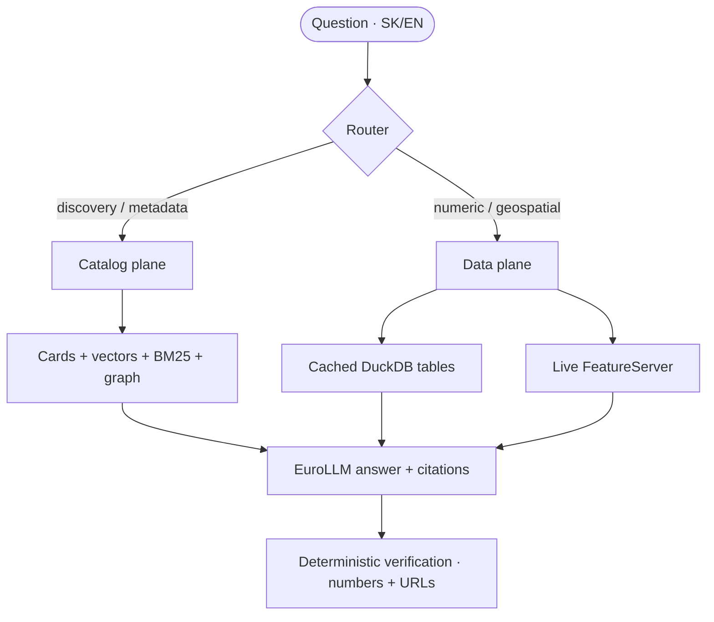

# Architecture

## Two planes, one router

The router is a small rule-based classifier. It sends data-shaped questions
("koľko", "how many", "priemer") to the data plane and everything else to the catalog
plane. Geospatial questions can use both. Follow-up questions are first rewritten into a
standalone question using the client-supplied conversation history.

## Components

- **Ingest** (`src/opendata_llm/ingest/`) – DCAT feed, Hub search records, layer schemas,
  bulk download.
- **Semantic layer** (`semantic/`) – a controlled SK/EN vocabulary and a knowledge graph
  of datasets, concepts, publishers, formats and districts.
- **Index** (`index/`) – dataset cards, embeddings, BM25.
- **Retrieval** (`retrieve/`) – hybrid BM25 + vector + concept + place, fused with
  Reciprocal Rank Fusion (RRF), then reranked by a cross-encoder.
- **Data plane** (`query/`) – read-only SQL over cached tables, a `column_values` dictionary
  of low-cardinality values, and a live ArcGIS client.
- **Geospatial** (`geo/`) – district gazetteer and spatial joins via DuckDB `spatial`.
- **Generation** (`generate/`) – MLX provider, prompts, RAG orchestration, the router and
  deterministic answer verification.
- **Interfaces** – CLI (`cli.py`), FastAPI (`app/`) and an MCP server (`mcp_server.py`).

## Data flow

1. `ingest catalog` merges the DCAT feed with Hub search records (licence, categories,
   tags, views). DCAT is treated as canonical; search data enriches it.
2. `download` saves distribution files under `data/downloads/` with a per-file size cap.
3. `graph build` normalises keywords/categories into 19 bilingual concepts and adds
   similarity edges (IDF-weighted concept overlap) and curated Hub `related` links.
4. `index build` writes one card per dataset, embeds it with `bge-m3` and builds the
   DuckDB FTS index.
5. `ask` rewrites a follow-up into a standalone question, retrieves and reranks
   candidates, and either answers from the cards or runs a grounded SQL query against a
   cached table. Answers are checked deterministically (numbers and cited sources).

## Decisions and why

- **DCAT as canonical, search as enrichment** – the feed is well-structured but omits
  licence/categories; the search API has them. Merging both gives richer cards.
- **`dataset_id` = DCAT URI, not ArcGIS item id** – a few datasets share one ArcGIS item,
  so keying by item id would silently drop them.
- **Multi-pass search fetch** – the Hub search API caps pages at 100 with unstable
  ordering; several passes are unioned until `numberMatched` unique records are seen.
- **DuckDB for everything** – one local file holds the catalog, the graph, vectors, the
  FTS index and the cached data tables (with `spatial` for geometry). No external services.
- **Graph + concepts** – pure embeddings miss the portal's Slovak vocabulary. Canonical
  concepts and place matching make SK and EN queries behave the same.
- **Stateless multi-turn** – the client sends the recent turns; the server only rewrites
  the latest question, so no session state is stored.
- **Deterministic verification** – answers are checked against the evidence with rules,
  not with a second (slower, non-deterministic) model call.

## Latency & streaming

- The generation model and the reranker are loaded **once per server process** and cached
  process-wide; the API warms both at startup so the first request is fast.
- The SQL path only runs for genuine numeric questions (intent `data`), and candidate
  tables are ranked by overlap with the query — not by the place-boosted retrieval order.
- Answers are kept short (`max_tokens: 384`).
- `POST /ask/stream` streams the answer token-by-token (SSE), so the UI shows text
  immediately even though the 22B model generates at a modest rate.
- Run uvicorn with a **single worker**: one MLX model cannot be shared across processes.
