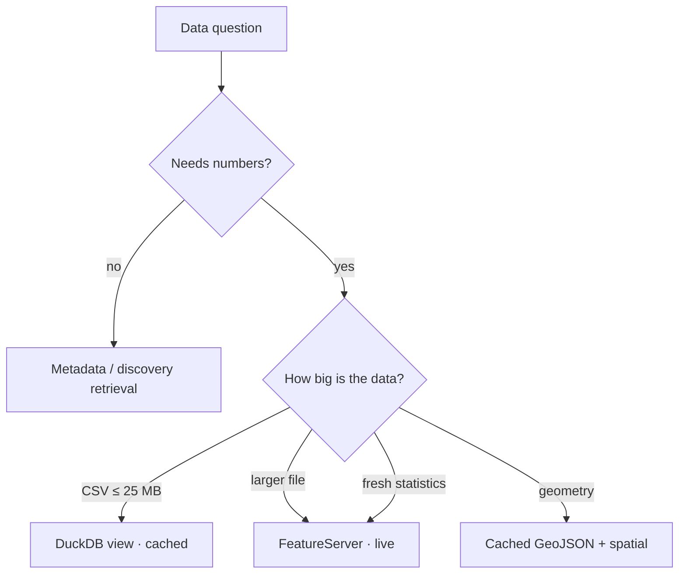

# Data & Querying

## Where the data comes from

| Source | Endpoint | What we take |
| --- | --- | --- |
| DCAT-AP feed | `/api/feed/dcat-ap/2.1.1` | 669 datasets, distributions, keywords |
| Hub search (OGC API Records) | `/api/search/v1/collections/dataset/items` | 620 records: licence, categories, tags, views |
| Related links | `.../items/{id}/related` | curated dataset-to-dataset edges |
| FeatureServer metadata | `{item.url}/{layer}?f=json` | 619 layer schemas (fields, geometry, extent) |
| Distribution files | `/api/download/v1/items/{id}/...` | CSV, GeoJSON, XLSX, TXT, KML |

## Local cache vs live API

Datasets range from a few rows to hundreds of megabytes, so we do **not** mirror
everything. The choice is deliberate:



| Situation | Approach | Why |
| --- | --- | --- |
| Small/medium tabular data (CSV ≤ 25 MB) | **Cached** as a DuckDB view | instant SQL, works offline |
| Large files | **Live** FeatureServer query | avoids multi-GB downloads |
| Fresh counts/statistics | **Live** FeatureServer query | always current |
| Geometry layers | **Cached** GeoJSON → DuckDB `spatial` | fast point-in-polygon |
| Text/metadata | **Cached** in the catalog | needed for retrieval |

### What was actually downloaded

- **2,061 files / ~785 MB** (CSV 611, GeoJSON 602, KML 436, XLSX 209, TXT 203).
- **38 skipped** because a single file exceeded the 25 MB cap.
- **~178 failed** – almost all are KML requests on non-spatial tables (HTTP 424), which
  is expected: tabular data cannot be rendered as KML.
- **611 CSVs** are exposed as DuckDB views (`ds_<item_id>_csv`), plus **14 spatial
  layers** (`geo_<item_id>`).

:::note Why a size cap?
A 25 MB per-file limit keeps the local cache small and fast while covering the large
majority of datasets. Anything bigger stays available through the live API.
:::

## Querying

Cached data (SQL):

```bash
bdata data sql "SELECT ROK, MESTSKA_CAST, POCET_PRIESTUPKOV
                     FROM ds_db2bc2a556af4a3dbb1d76107769a089_csv
                     WHERE MESTSKA_CAST = 'Ružinov' AND ROK = 2025"
```

Live ArcGIS:

```bash
bdata data live "počet priestupkov podľa mestských častí" \
  --where "MESTSKA_CAST='Ružinov' AND ROK=2025" \
  --columns "ROK,MESTSKA_CAST,POCET_PRIESTUPKOV"
```

The assistant uses the same paths automatically: for data questions it generates a
`SELECT`, runs it read-only, and feeds the result back to the model. Every answer is then
verified deterministically — each number must be grounded in the query result and each
cited URL must be one of the retrieved sources. Failures are reported as warnings
(`answer_verified`), without a second model call.

Rebuild the value dictionary (also part of `make data`):

```bash
bdata data profile
```

## Value dictionary and ambiguity

`make data` profiles every loaded table into `column_values`: the distinct values of
low-cardinality columns (≤ 50 distinct, first 200k rows). The dictionary is used to

- resolve a district to its exact stored spelling,
- offer the model the real values of columns the question quotes, and
- detect a requested category that the data does not define.

When a question asks for a category that does not exist (e.g. *obytné* among
`Druh pozemku`), the assistant does not guess or refuse. It returns the real breakdown
of that column and notes that the requested category is not defined.

## Multi-turn questions

The server stays stateless: the client sends the recent turns and the server rewrites the
latest question into a standalone query before retrieval and SQL.

- API: `POST /ask` and `POST /ask/stream` accept an optional
  `history: [{role, content}, ...]` (the last ~6 turns).
- CLI: `bdata ask "A koľko v Ružinove?" --turn "user:Koľko pozemkov v Petržalke?"`.
- The streaming endpoint emits a `rewriting` status event and returns the rewritten query
  in the `sources` event.

## Geospatial

- District boundaries are fetched once from the portal's "Mestská časť" layer into a
  `geo_places` table (17 districts + Bratislava).
- `place_slug` maps names tolerantly (Slovak inflection: "Ružinov" → "Ružinove").
- Dataset cards are linked to districts by text, and spatial layers by geometry.
- Extents from ArcGIS are in a projected CRS, so district matching uses real geometry
  (`ST_Intersects`) rather than bounding boxes.
