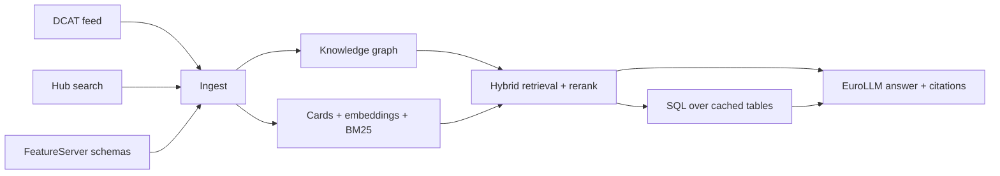

# Bratislava Open Data LLM

A local, bilingual (Slovak / English) assistant that answers questions about the open
data of the City of Bratislava on [data.bratislava.sk](https://data.bratislava.sk).

The portal publishes ~670 datasets through an ArcGIS Hub instance, with a DCAT-AP feed,
an OGC API Records search API and ArcGIS FeatureServer services. This project turns that
into a question-answering system: "which dataset covers X?", "how many offences were
recorded in Ružinov in 2025?", "what data exists about air quality?".

## What it does

- **Discovery** – find datasets by meaning, in Slovak or English, with links and licence.
- **Metadata questions** – formats, update dates, publisher, column schema.
- **Data questions** – run SQL over a locally cached copy of tabular datasets.
- **Geospatial** – resolve a Bratislava district or a coordinate to datasets.

## Two planes

The system is deliberately split in two, because the two problems need different methods:

| Plane | Answers | Technique |
| --- | --- | --- |
| **Catalog** | "what exists" | embeddings + BM25 + knowledge graph over dataset cards |
| **Data** | "how many / where" | SQL over cached tables and live ArcGIS queries |

Vector search is great for language but cannot count rows, so numeric questions are
routed to the data plane. See [Architecture](/architecture) for details.

## Pipeline at a glance



1. **Ingest** the DCAT feed, the Hub search records and FeatureServer schemas.
2. **Download** distributions (CSV/GeoJSON/…) with a size cap.
3. **Graph** – link datasets to concepts, publishers, formats, districts and each other.
4. **Index** – build a bilingual card per dataset, embed it and build the BM25 index.
5. **Answer** – hybrid retrieve → rerank → generate, with a SQL step for data questions.

## Quick start

```bash
make setup     # install dependencies (uv)
make model     # download the 12 GB model (resumable, optional to start)
make build     # ingest -> download -> graph -> index -> data -> geo

source .venv/bin/activate    # so `bdata` is on PATH (or prefix with `uv run`)
bdata ask "Koľko priestupkov bolo v Ružinove v roku 2025?"
```

See [Setup](/setup) for a step-by-step walkthrough and
[Developer guide](/developer-guide) for configuration and tuning.

Use the **English / Slovenčina** switch in the top-right to change language.
