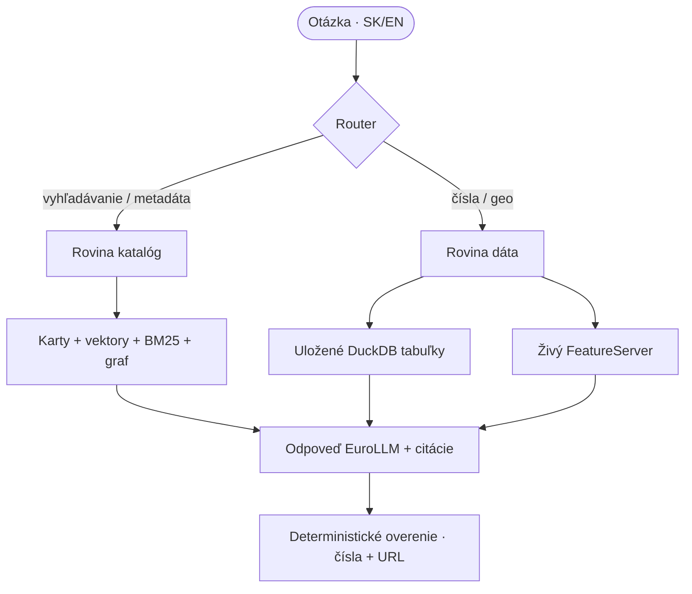

# Architektúra

## Dve roviny, jeden router

Router je malý klasifikátor založený na pravidlách. Otázky tvaru „koľko", „how many",
„priemer" posiela do dátovej roviny, ostatné do katalógovej. Geopriestorové otázky môžu
využiť obe. Nadväzujúce otázky sa najprv prepíšu na samostatnú otázku pomocou histórie
konverzácie od klienta.

## Komponenty

- **Ingest** (`src/opendata_llm/ingest/`) – DCAT feed, Hub vyhľadávanie, schémy vrstiev, hromadné sťahovanie.
- **Sémantická vrstva** (`semantic/`) – riadený slovník SK/EN a znalostný graf datasetov, konceptov, vydavateľov, formátov a mestských častí.
- **Index** (`index/`) – karty datasetov, embeddingy, BM25.
- **Vyhľadávanie** (`retrieve/`) – hybrid BM25 + vektory + koncepty + mestské časti, zlúčené pomocou RRF, následne reranking cross-encoderom.
- **Dátová rovina** (`query/`) – iba na čítanie SQL nad uloženými tabuľkami, slovník nízkokardinalitných hodnôt `column_values` a živý ArcGIS klient.
- **Geopriestor** (`geo/`) – gazetteer mestských častí a priestorové spoje cez DuckDB `spatial`.
- **Generovanie** (`generate/`) – MLX poskytovateľ, prompty, RAG orchestrácia, router a deterministické overenie odpovede.
- **Rozhrania** – CLI (`cli.py`), FastAPI (`app/`) a MCP server (`mcp_server.py`).

## Tok dát

1. `ingest catalog` zlúči DCAT feed so záznamami Hub vyhľadávania (licencia, kategórie, tagy). DCAT je kanonický, vyhľadávanie ho dopĺňa.
2. `download` uloží distribučné súbory do `data/downloads/` s limitom veľkosti.
3. `graph build` normalizuje kľúčové slová a kategórie na 19 dvojjazyčných konceptov a pridá hrany podobnosti (IDF vážený prienik) a kurátorské väzby `related`.
4. `index build` vytvorí kartu pre každý dataset, vloží embedding `bge-m3` a postaví FTS index.
5. `ask` prepíše nadväzujúcu otázku na samostatnú, vyberie a prerankuje kandidátov a odpovie buď z kariet, alebo spustí podložený SQL nad uloženou tabuľkou. Odpovede sa overujú deterministicky (čísla a citované zdroje).

## Rozhodnutia a ich dôvody

- **DCAT ako kanonický, vyhľadávanie ako doplnok** – feed je dobre štruktúrovaný, ale chýba mu licencia a kategórie; tie má vyhľadávanie.
- **`dataset_id` = DCAT URI, nie ArcGIS item id** – niekoľko datasetov zdieľa jeden ArcGIS item, podľa item id by sa stratili.
- **Viackolové sťahovanie vyhľadávania** – API stránkuje po 100 s nestabilným poradím; spája sa viac prechodov, kým sa nedosiahne `numberMatched` unikátnych záznamov.
- **DuckDB na všetko** – jeden lokálny súbor drží katalóg, graf, vektory, FTS index aj uložené tabuľky (so `spatial` pre geometriu).
- **Graf + koncepty** – čisté embeddingy nezachytia slovenskú slovnú zásobu portálu. Kanonické koncepty a mestské časti zjednocujú správanie SK a EN otázok.
- **Bezstavové nadväzujúce otázky** – klient posiela posledné ťahy; server prepisuje iba najnovšiu otázku, takže sa neukladá žiadny stav relácie.
- **Deterministické overenie** – odpovede sa kontrolujú pravidlami voči evidencii, nie druhým (pomalším a nedeterministickým) volaním modelu.

## Latencia a streamovanie

- Generatívny model a reranker sa načítajú **raz na proces servera** a držia v pamäti;
  API oba zahreje pri štarte, takže prvý dopyt je rýchly.
- SQL cesta sa spúšťa len pri skutočných numerických otázkach (intent `data`) a kandidátske
  tabuľky sa zoraďujú podľa prieniku s otázkou – nie podľa poradia z vyhľadávania.
- Odpovede sú krátke (`max_tokens: 384`).
- `POST /ask/stream` streamuje odpoveď po tokenoch (SSE), takže UI zobrazuje text okamžite,
  aj keď 22B model generuje pomalšie.
- Spúšťajte uvicorn s **jedným workerom**: jeden MLX model sa nedá zdieľať medzi procesmi.
