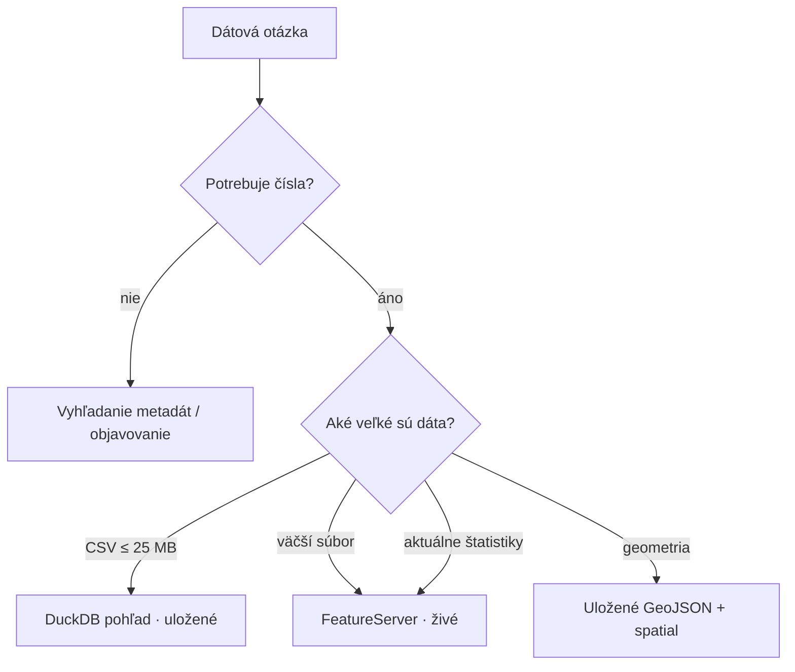

# Dáta a dopyty

## Odkiaľ dáta pochádzajú

| Zdroj | Endpoint | Čo berieme |
| --- | --- | --- |
| DCAT-AP feed | `/api/feed/dcat-ap/2.1.1` | 669 datasetov, distribúcie, kľúčové slová |
| Hub vyhľadávanie (OGC API Records) | `/api/search/v1/collections/dataset/items` | 620 záznamov: licencia, kategórie, tagy, zobrazenia |
| Väzby `related` | `.../items/{id}/related` | kurátorské hrany medzi datasetmi |
| FeatureServer metadáta | `{item.url}/{layer}?f=json` | 619 schém vrstiev (stĺpce, geometria, rozsah) |
| Distribučné súbory | `/api/download/v1/items/{id}/...` | CSV, GeoJSON, XLSX, TXT, KML |

## Lokálna cache vs živé API

Datasety majú od pár riadkov po stovky megabajtov, preto **nezrkadlíme** všetko. Voľba
je zámerná:



| Situácia | Postup | Prečo |
| --- | --- | --- |
| Malé/stredné tabuľky (CSV ≤ 25 MB) | **Uložené** ako DuckDB pohľad | okamžité SQL, funguje offline |
| Veľké súbory | **Živý** FeatureServer dopyt | vyhne sa sťahovaniu gigabajtov |
| Aktuálne počty/štatistiky | **Živý** FeatureServer dopyt | vždy aktuálne |
| Geometrické vrstvy | **Uložené** GeoJSON → DuckDB `spatial` | rýchly point-in-polygon |
| Text/metadáta | **Uložené** v katalógu | potrebné na vyhľadávanie |

### Čo sa skutočne stiahlo

- **2 061 súborov / ~785 MB** (CSV 611, GeoJSON 602, KML 436, XLSX 209, TXT 203).
- **38 preskočených**, lebo jeden súbor prekročil limit 25 MB.
- **~178 zlyhalo** – takmer všetko sú KML dopyty na netabuľkové datasety (HTTP 424), čo
  je očakávané: tabuľkové dáta sa nedajú vykresliť ako KML.
- **611 CSV** je sprístupnených ako DuckDB pohľady (`ds_<item_id>_csv`) a **14
  priestorových vrstiev** (`geo_<item_id>`).

:::note Prečo limit veľkosti?
Limit 25 MB na súbor drží lokálnu cache malú a rýchlu a pokrýva veľkú väčšinu datasetov.
Väčšie datasety zostávajú dostupné cez živé API.
:::

## Dopyty

Uložené dáta (SQL):

```bash
bdata data sql "SELECT ROK, MESTSKA_CAST, POCET_PRIESTUPKOV
                     FROM ds_db2bc2a556af4a3dbb1d76107769a089_csv
                     WHERE MESTSKA_CAST = 'Ružinov' AND ROK = 2025"
```

Živý ArcGIS:

```bash
bdata data live "počet priestupkov podľa mestských častí" \
  --where "MESTSKA_CAST='Ružinov' AND ROK=2025" \
  --columns "ROK,MESTSKA_CAST,POCET_PRIESTUPKOV"
```

Asistent používa tie isté cesty automaticky: pri dátových otázkach vygeneruje `SELECT`,
spustí ho v režime iba na čítanie a výsledok vráti modelu.

## Geopriestor

- Hranice mestských častí sa raz stiahnu z vrstvy „Mestská časť" do tabuľky `geo_places`
  (17 častí + Bratislava).
- `place_slug` priraďuje názvy tolerantne (slovenské skloňovanie: „Ružinov" → „Ružinove").
- Karty datasetov sa viažu k mestským častiam textom, priestorové vrstvy geometriou.
- Rozsahy z ArcGIS sú v projektovanom súradnicovom systéme, preto priradenie používa
  skutočnú geometriu (`ST_Intersects`) a nie ohraničujúce obdĺžniky.
