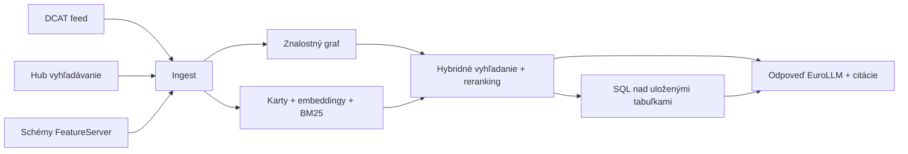

# Bratislava Open Data LLM

Lokálny, dvojjazyčný (slovenský / anglický) asistent, ktorý odpovedá na otázky o
otvorených dátach mesta Bratislava na [data.bratislava.sk](https://data.bratislava.sk).

Portál zverejňuje približne 670 datasetov cez ArcGIS Hub, s DCAT-AP feedom, OGC API
Records (vyhľadávanie) a ArcGIS FeatureServer službami. Tento projekt z toho vytvára
systém otázok a odpovedí: „ktorý dataset pokrýva X?", „koľko priestupkov bolo v Ružinove
v roku 2025?", „aké dáta existujú o kvalite ovzdušia?".

## Čo systém vie

- **Vyhľadávanie** – nájde datasety podľa významu, po slovensky aj anglicky, s odkazmi a licenciou.
- **Metadáta** – formáty, dátum aktualizácie, vydavateľ, schéma stĺpcov.
- **Dátové otázky** – spustí SQL nad lokálne uloženou kópiou tabuľkových datasetov.
- **Geopriestorové otázky** – priradí bratislavskú mestskú časť alebo súradnicu k datasetom.

## Dve roviny

Systém je zámerne rozdelený na dve časti, pretože tieto dva problémy potrebujú odlišné
metódy:

| Rovina | Odpovedá na | Metóda |
| --- | --- | --- |
| **Katalóg** | „čo existuje" | embeddingy + BM25 + znalostný graf nad kartami datasetov |
| **Dáta** | „koľko / kde" | SQL nad uloženými tabuľkami a živé ArcGIS dopyty |

Vektorové hľadanie je výborné na jazyk, ale nevie počítať riadky, preto numerické otázky
smerujú do dátovej roviny. Detaily sú v časti [Architektúra](/architecture).

## Priebeh spracovania



1. **Ingest** – DCAT feed, záznamy Hub vyhľadávania a schémy FeatureServer vrstiev.
2. **Download** – distribúcie (CSV/GeoJSON/…) s limitom veľkosti.
3. **Graf** – prepojenie datasetov s konceptmi, vydavateľmi, formátmi, mestskými časťami a navzájom.
4. **Index** – dvojjazyčná karta pre každý dataset, embedding a BM25 index.
5. **Odpoveď** – hybridné vyhľadanie → reranking → generovanie, so SQL krokom pre dátové otázky.

## Rýchly štart

```bash
make setup     # inštalácia závislostí (uv)
make model     # stiahnutie 12 GB modelu (obnoviteľné, voliteľné na začiatok)
make build     # ingest -> download -> graph -> index -> data -> geo

source .venv/bin/activate    # aby bol `bdata` na PATH (alebo použite `uv run`)
bdata ask "Koľko priestupkov bolo v Ružinove v roku 2025?"
```

Krok za krokom nájdete v [Inštalácii](/setup) a ladenie parametrov v
[Príručke pre vývojárov](/developer-guide).

Jazyk zmeníte prepínačom **English / Slovenčina** vpravo hore.
